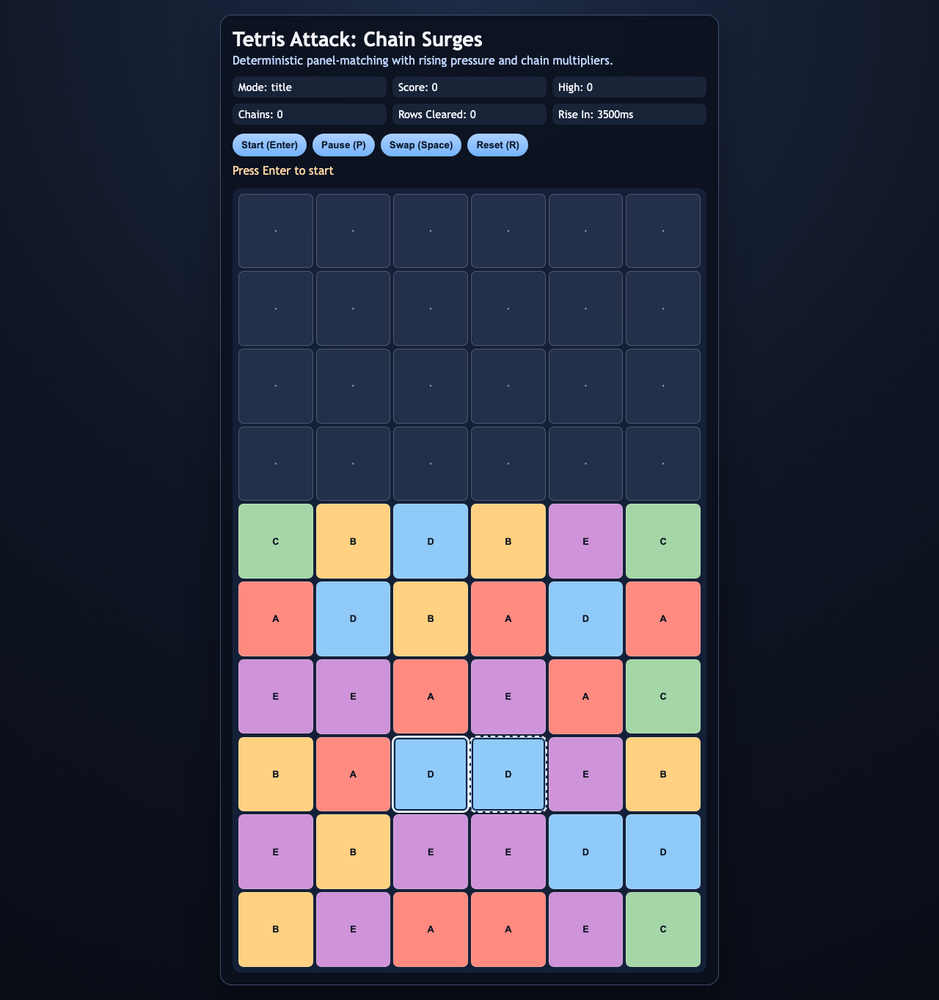
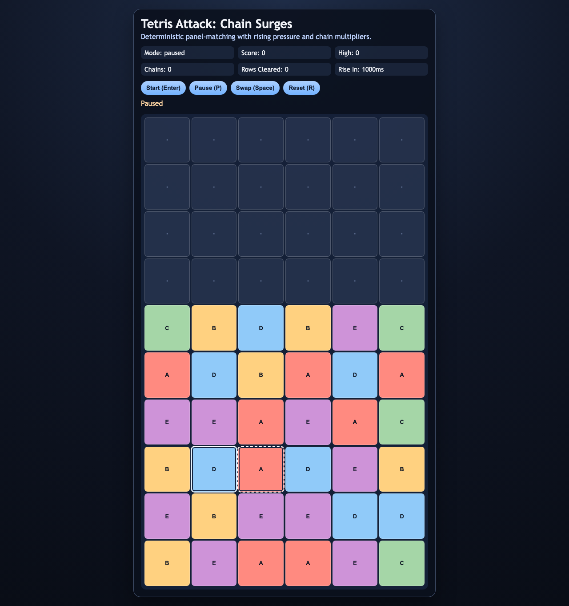

# daily-classic-game-2026-03-25-tetris-attack-chain-surges

<div align="center">
  <p>Deterministic Tetris Attack-inspired panel matching where rising rows force fast swaps, and chain cascades turn clean setups into score surges.</p>
</div>

<div align="center">
  <p>
    
    
    
  </p>
</div>

## GIF Captures

- `Opening Grid`: `artifacts/playwright/clip-opening-grid.gif`
- `Chain Surge`: `artifacts/playwright/clip-chain-surge.gif`
- `Pause Reset Cycle`: `artifacts/playwright/clip-pause-reset-cycle.gif`

## Quick Start

```bash
pnpm install
pnpm test
pnpm build
pnpm capture
```

## How To Play

Press `Enter` to start. Move the cursor with arrow keys and press `Space` (or `X`) to swap the selected adjacent pair. Build three-in-a-row matches before the board reaches the top.

## Rules

- Matches clear when 3 or more identical panels align horizontally or vertically.
- Cleared panels fall via gravity and can trigger cascades.
- The board rises automatically on a fixed timer.
- Run ends when the top row is occupied and the board attempts to rise.
- `P` toggles pause, `R` resets, and `Shift+R` resets including high score.

## Scoring

- Base score: `10` points per cleared panel.
- Chain multiplier: each cascade depth in one resolve sequence multiplies panel points (`x1`, `x2`, ...).
- High score persists across normal resets.

## Twist

This run uses the `chains` twist candidate from the catalog. Chain depth is the dominant scoring mechanic, so optimal play prioritizes cascade setup over single clears.

## Verification

- `pnpm test`
- `pnpm build`
- `pnpm capture`
- Browser hooks:
  - `window.advanceTime(ms)`
  - `window.render_game_to_text()`

## Project Layout

- `src/game-core.js`: deterministic game loop, rules, matching, scoring, and hooks
- `src/main.js`: UI renderer and input bindings
- `tests/game-core.test.mjs`: deterministic rule and chain checks
- `tests/capture.spec.mjs`: Playwright captures and action payload artifacts
- `artifacts/playwright/`: screenshots, action JSON, render output, and GIF placeholders
